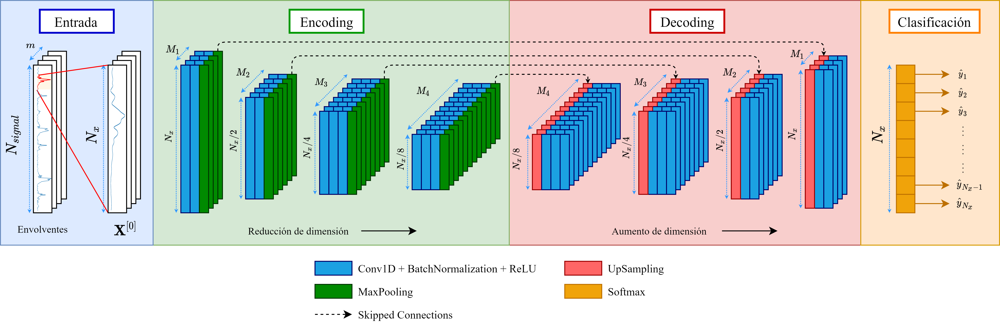
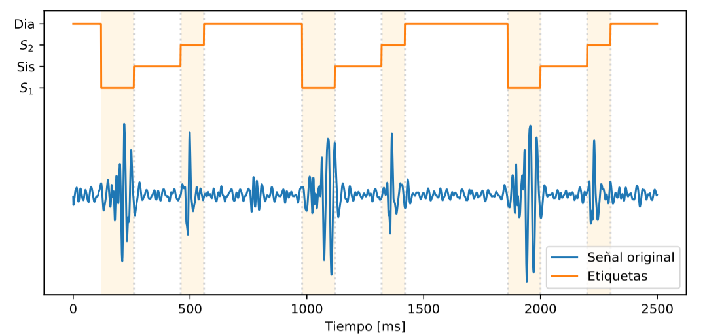

# Predicción de sonidos cardiacos

Este repositorio contiene los códigos utilizados para el desarrollo de un sistema de predicción de sonidos cardiacos mediante redes neuronales convolucionales (CNN). Este modelo permite predecir los instantes de ocurrencia del primer sonido cardiaco (S1) y el segundo sonido cardiaco (S2), a partir de los cuales se puede inferir los intervalos sistólicos y diastólicos.

El desarrollo de este proyecto se realizó en el contexto de mi investigación de Magíster en Ciencias de la Ingeniería titulada "[*Design of a preprocessing system for sounds obtained from chest auscultation*](https://repositorio.uc.cl/handle/11534/60994)" en la Pontificia Universidad Católica de Chile.

## 1. Background teórico

El fonocardiograma (PCG) corresponde a la grabación de las ondas acústicas producidas por las aperturas y cierres de las válvulas cardiacas. Los componentes principales del PCG son el primer sonido cardiaco (S1) y el segundo sonido cardiaco (S2). 

S1 es generado durante el sístole ventricular (cierre de las válvulas atrioventriculares: mitral/bicúspide y tricúspide), en el cual los ventrículos se contraen y permiten que la sangre sea bombeada desde el corazón hacia el resto del cuerpo a través de las arterias aorta y pulmonar. S2 ocurre durante la diástole ventricular (cierre de las válvulas sigmoideas/semilunares: aórtica y pulmonar) en el cual los ventrículos se relajan y permiten el ingreso de la sangre desde los atrios. En comparación, S1 es un sonido de menor tono con mayor duración, mientras que S2 es un sonido de mayor tono con menor duración.

En este trabajo, se utilizan redes neuronales convolucionales (CNN) para detectar la presencia de los sonidos cardiacos fundamentales. Una de las ventajas que presentan las CNN es que permite lograr independencia de las relaciones temporales de la señal, ya que cada capa convolucional puede entenderse como un filtro que se ajusta para detectar los segmentos de interés dentro del sonido cardiaco. Se propone el estudio de una CNN basada en una arquitectura *encoder-decoder*, inspirada en la red [SegNet](https://arxiv.org/abs/1511.00561) (ver figura 1).

<figure>
	<div style="text-align:center">
		
    </div>
	<figcaption align = "center"><b>Figura 1: Encoder-Decoder CNN basado en SegNet.</b></figcaption>
</figure>

A partir de los resultados de este estudio se define la arquitectura disponible en la carpeta `models` para abordar el problema de la segmentación de los sonidos cardiacos (para más detalle sobre las conclusiones de este trabajo, se recomienda revisa el capítulo 2 de la tesis "[*Design of a preprocessing system for sounds obtained from chest auscultation*](https://repositorio.uc.cl/handle/11534/60994)").

## 2. Base de datos

Para el entrenamiento de este sistema, se utilizó una base de datos de sonidos cardiacos disponible en la implementación de Springer titulada "[Logistic Regression-HSMM-based Heart Sound Segmentation](https://physionet.org/content/hss/1.0/)", la cual fue presentada para la etapa de segmentación de sonidos cardiacos en el contexto del desafío PhysioNet/CinC del año 2016. 

Esta base de datos cuenta con 792 registros de audio de obtenidos a partir de 135 pacientes distintos, los cuales son auscultados en distintas posiciones del pecho. Cada uno de estos archivos de audio se encuentra muestreado a 1000 Hz, y posee etiquetas muestreadas a 50 Hz que indican 4 posibles estados: S1, sístole, S2 y diástole. Estas etiquetas son definidas con el *peak*-R y el final de la onda T de un electrocardiograma (ECG) sincronizado con el estetoscopio con el que se grabaron los sonidos cardiacos. Sin embargo, ninguna de las etiquetas proporcionadas poseen corrección humana.

En la figura 2 es posible apreciar un ejemplo de un sonido cardiaco en conjunto con sus etiquetas.

<figure>
	<div style="text-align:center">
		
    </div>
	<figcaption align = "center"><b>Figura 2: Sonidos cardiacos y etiquetas proporcionadas.</b></figcaption>
</figure>

## 3. Contenido del repositorio

Las carpetas que componen este proyecto son:

* `hsp_utils`: Contiene funciones que permiten operar las funciones principales de segmentación.
* `imgs`: Carpeta con imágenes que se incluyen en este `README`.
* `jupyter_test`: Contiene el archivo `testing_notebook.ipynb` que permite realizar experimentos del modelo entrenado sobre los archivos disponibles en la carpeta `samples_test`.
* `models`: Contiene el modelo final entrenado en formato `.h5`.
* `samples_test`: Contiene una pequeña muestra de la base de datos presentada en la [sección 2](#2-base-de-datos).
* `training_scripts`: Contiene algunos de los archivos utilizados para el entrenamiento de las redes. Sin embargo, no se asegura el correcto funcionamiento de estos archivos. Se incluyen simplemente para tener una noción de cómo se implementó este proyecto. Para más detalles se recomienda revisar en el repositorio [`Scripts_magister`](https://github.com/cmescobar/Scripts_Magister) la carpeta [`Heart_sound_segmentation_v2`](https://github.com/cmescobar/Scripts_Magister/tree/master/Heart_sound_segmentation_v2) para ver el historial de cambios sobre este experimento (:warning:**Se advierte de manera previa que esa carpeta corresponde a una etapa experimental/borrador del trabajo realizado, y por ende, no se encuentra ordenada ni es apta para utilizar directamente los códigos. En caso de estar interesado en más detalle aún, se sugiere contactar a mi correo personal.**:warning:)
* `main.py`: Archivo que contiene un ejemplo de ejecución para la función que realiza la predicción de los instantes de ocurrencia de los sonidos cardiacos.
* `prediction_functions.py`: Archivo que contiene las funciones que permiten aplicar la predicción de las posiciones de los sonidos cardiacos utilizando la red CNN con arquitectura *encoder-decoder*.

## 4. Bibliotecas requeridas

Para el desarrollo de estos módulos se utilizó la siguiente lista de bibliotecas. Debido a que no se puede asegurar el correcto funcionamiento del repositorio para versiones posteriores de estas bibliotecas, se incorporará también la versión de cada una.

* [NumPy](https://numpy.org/) (1.18.4)
* [SciPy](https://scipy.org/) (1.5.4)
* [Tensorflow](https://www.tensorflow.org/) (2.3.1) 
* [Matplotlib](https://matplotlib.org/) (3.3.2)
* [Soundfile](https://pysoundfile.readthedocs.io/en/latest/) (0.10.3)
* [PyWavelets](https://pywavelets.readthedocs.io/en/latest/) (1.0.3)
* [PyEMD](https://pyemd.readthedocs.io/en/latest/intro.html) (0.2.10)

## 5. Ejemplo de prueba

Un ejemplo de prueba se deja a disposición en el *notebook* de la dirección `jupyter_test/testing_notebook.ipynb`, el cual contiene una ejecución guiada de la función de predicción.

Se deja a continuación un código similar al disponible en el archivo `main.py`.

```python
import numpy as np
import soundfile as sf
import matplotlib.pyplot as plt
from scipy.io import loadmat
from prediction_functions import hss_segmentation

# Parámetros
lowpass_params = {'freq_pass': 140, 'freq_stop': 150}
model_name = 'definitive_segnet_based'
db_folder = 'samples_test'

# Abriendo audio de ejemplo
filename = 'samples_test/435_Patient081_Dis1'
audio, samplerate = sf.read(f'{filename}.wav')
labels = loadmat(f'{filename}.mat')['PCG_states']

# Obteniendo la salida de la red
_, y_hat_to, (y_out2, y_out3, y_out4) = \
        hss_segmentation(audio, samplerate, model_name,
        length_desired=len(audio),
        lowpass_params=lowpass_params,
        plot_outputs=False)
```

