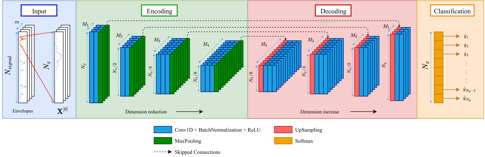

# Heart sound segmentation

This repository contains the codes used for the development of a heart sound prediction system from phonocardiograms (PCG) using Convoloutional Neural Networks (CNN). This model allows prediction of the time of occurence of the first heart sound (S1) and the second heart sound (S2), from which the systolic and diastolic intervals can be inferred.

The development of this project was performed in the context of my Master of Engineering Sciences research entitled "[*Design of a preprocessing system for sounds obtained from chest auscultation*](https://repositorio.uc.cl/handle/11534/60994)" at Pontificia Universidad Catolica de Chile, which derived in the paper entitled "Study of hyperparameters in the semantic segmentation of heart sounds".

## 1. Theoretical background

The phonocardiogram (PCG) is a recording of the heart sounds produced by the opening and closing of the heart valves. The main components of the PCG are the first heart sound (S1) and the second heart sound (S2).

S1 is generated during ventricular systole (closure of the atrioventricular valves: mitral/bicuspid and tricuspid), in which the ventricles contract and
allow blood to be pumped from the heart to the rest of the body through the aorta and pulmonary arteries. S2 occurs during ventricular diastole (closure of the sigmoid/semilunar valves: aortic and pulmonary) in which the ventricles relax and allow blood to flow in from the atria. In comparison, S1 is a lower-pitched sound of longer duration, while S2 is a higher-pitched sound of shorter duration. 

In this work, CNNs are used to detect the presence of fundamental heart sounds. One of the advantages of this type of the networks is that they allow independence of the temporal relationships of the signal. Each convolutional layer can be understood as a filter that is adjusted to detect the segments of interest within the heart sound. A semantic segmentation architecture based on the [SegNet](https://arxiv.org/abs/1511.00561) network is proposed (see figure 1).

<figure>
	<div style="text-align:center">
		
    </div>
	<figcaption align = "center"><b>Figure 1: Semantic Segmentation CNN.</b></figcaption>
</figure>

<br/>Based on the results of this study, the architecture available in the `models` folder is defined to address the problem of heart sound segmentation (for more details on the findings of this work, please refer to chapter 2 of the thesis "[*Design of a preprocessing system for sounds obtained from chest auscultation*](https://repositorio.uc.cl/handle/11534/60994)".


## 2. Database

For training this system, we used a dataset of heart sounds available in the Springer implementation titled "[Logistic Regression-HSMM-based Heart Sound Segmentation](https://physionet.org/content/hss/1.0/)", presented for the heart sound segmentation stage in the context of the 2016 PhysioNet/CinC challenge. 

This dataset contains 792 audio records obtained from 135 different patients, who are auscultated in different chest positions. Each of these audio files is sampled at 1000 Hz, and has labels sampled at 50 Hz indicating 4 possible states: S1, systole, S2 and diastole. These labels are defined with the R peak and the end of the T wave of an ECG synchronised with the stethoscope used for recording the heart sounds. However, none of the labels provided have human correction.

Figure 2 shows an example of a heart sound in conjunction with its labels.

<figure>
	<div style="text-align:center">
		
    </div>
	<figcaption align = "center"><b>Figure 2: Heart sounds and their labels.</b></figcaption>
</figure>

## 3. Repository contents

The folders and files that comprise this project are:

* `hsp_utils`: Contains functions to operate the main segmentation functions.
* `imgs`: Folder with images included in this `README`.
* `jupyter_test`: Contains the }`testing_notebook.ipynb` file that allows to perform experiments of the presented model on the files available in the `samples_test` folder.
* `models`: Contains the trained Convolutional Neural Network (CNN) for the heart sound segmentation in `.h5` format.
* `samples_test`: Contains a small sample of the dataset presented in [section 2](#2-base-de-datos).
* `training_scripts`: It contains some of the files used for network training. However, the correct functioning of these files is not assured. They are included simply to get an idea of how this project was implemented. For more details, it is recommended to check the `Heart_sound_segmentation_v2` folder in the [`Scripts_magister`](https://github.com/cmescobar/Scripts_Magister) repository for the history of changes to this experiment ( :warning:**Please note that this folder belongs to an experimental/draft stage of the work done, and therefore, it is not ordered nor is it suitable for direct use of the codes. In case you are interested in more details, please contact my personal email address**:warning:).
* `main.py`: File containing an runtime example for the function that performs the prediction of heartbeat occurrence instants.
* `prediction_functions.py`: File containing the functions to implement the prediction of heart sound positions using the CNN network with semantic segmentation architecture.

## 4. Requirements

For the development of these modules the following list of libraries were used. Since the correct functioning of the repository cannot be ensured for later versions of these libraries, the version of each library will also be incorporated. This implementation was developed using Python 3.7.

* [NumPy](https://numpy.org/) (1.18.4)
* [SciPy](https://scipy.org/) (1.5.4)
* [Tensorflow](https://www.tensorflow.org/) (2.3.1) 
* [Matplotlib](https://matplotlib.org/) (3.3.2)
* [Soundfile](https://pysoundfile.readthedocs.io/en/latest/) (0.10.3)
* [PyWavelets](https://pywavelets.readthedocs.io/en/latest/) (1.0.3)
* [PyEMD](https://pyemd.readthedocs.io/en/latest/intro.html) (0.2.10)

## 5. Coding example

An example is provided in the notebook located at `jupyter_test/testing_notebook.ipynb`, which contains a guided execution of the prediction function.

The following code is similar to that available in the `main.py` file.

```python
import numpy as np
import soundfile as sf
import matplotlib.pyplot as plt
from scipy.io import loadmat
from prediction_functions import hss_segmentation

# Parameters
lowpass_params = {'freq_pass': 140, 'freq_stop': 150}
model_name = 'definitive_segnet_based'
db_folder = 'samples_test'

# Opening an audio sample
filename = 'samples_test/435_Patient081_Dis1'
audio, samplerate = sf.read(f'{filename}.wav')
labels = loadmat(f'{filename}.mat')['PCG_states']

# Getting the outputs of the network
_, y_hat_to, (y_out2, y_out3, y_out4) = \
        hss_segmentation(audio, samplerate, model_name,
        length_desired=len(audio),
        lowpass_params=lowpass_params,
        plot_outputs=False)
```
